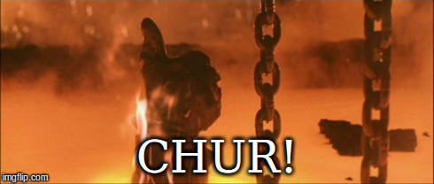

# \[2014\] Rawshark


**Metadata  
Country**: New Zealand  
**Active**: No  
**Alignment**: Neutral Good  
**Identity**: Unknown publicly, but likely known within the NZ hacker community.  
**Feelpinion**: ?


## History

### Whaledump Hack \[Early 2014\]


Whale Oil Beef Hooked \(generally referred to as WhaleOil\) is the personal blog of Cameron Slater which he started in 2005.

The unknown hacker/hackers working independently  Nicky Hager \(born 1958\) is a New Zealand investigative journalist.

@whaledump was suspended by Twitter. A real account @whaledump2 is still exists for reference, and will unlikely ever be touched again.

Rawshark has vanished.



## Details

A tweet to confirm the new account  [https://twitter.com/whaledump2/status/507316279624335361](https://twitter.com/whaledump2/status/507316279624335361) included a pastebin link which has since expired.  
The PGP key was confirmed by third parties [https://twitter.com/norightturnnz/status/507318317225615360](https://twitter.com/norightturnnz/status/507318317225615360)

```text
-----BEGIN PGP SIGNED MESSAGE-----
Hash: SHA512
 
@Whaledump2 is the true #Whaledump account.
 
- - rawshark
-----BEGIN PGP SIGNATURE-----
Version: GnuPG v1
 
iQEcBAEBCgAGBQJUB6pZAAoJEM2tXBLv89RnWa8H/ieVSZz4lyRT9bRGc8RQQXQq
PIC7oX2qu9txP9YGc3fsvgIJtgExpfhnO9Hay1CtlLwJtt4ss5kJOzAjjtZqPKto
ZDZl0rA90docqm7jvLrekruB7Vy5T1vbA1ZYdK6dhyGAfkBswW1ZK2PCI/CKE72B
+TEScU5F8XfhWXBe/RMzbdDN9qhzvj/V08soVusStDu2H/FFNTrZF6N6bLh8Sz9V
zhIXBVsMmds1hFklhT7t+pdKSnOhT2DqVdLt1aUwCFepjG7EA7HfzT+fiVtvPhoE
7Kqu28s9KGRhrJD3756R84O9z3ilWWye8Ln+vZfkTskx2hSqClXpAeb4c41Z39g=
=fMbA
-----END PGP SIGNATURE-----
```

## Reference material


